# Agentic Engineering Skills

A small, composable workflow for turning business requirements into verified software without adopting a heavyweight spec framework.

The repository is intentionally built as a collection of independent agent skills. Each skill owns one transition in the workflow and can be adapted or used separately.

## Workflow



Arrows between skills show the recommended next step, not automatic invocation. Each skill reports and waits for the user.

Every stage in the workflow exists today.

## Artifact model

### `requirements.md`

The original business request supplied by the user. It may be incomplete, ambiguous, contradictory, or inconsistent with the existing system. It is preserved unchanged as source material.

### `intent.md`

The clarified and human-approved business outcome produced through grilling. It captures actors, observable behavior, business rules, scenarios, constraints, and explicit exclusions without prescribing technical implementation.

### `contract.md`

The technical and verifiable agreement derived from `intent.md`. It will define boundaries such as inputs, outputs, types, errors, invariants, state transitions, and observable side effects without becoming an implementation plan.

## Principles

- Business intent is clarified before technical behavior is agreed.
- Agents investigate discoverable facts and ask humans for decisions.
- Humans approve meaning; agents implement and provide evidence.
- Artifacts describe boundaries and outcomes, not speculative internals.
- Skills remain independently understandable and explicitly invoked.
- Workflow depth should be proportional to the uncertainty and risk of a change.
- Tests, types, and runtime checks provide executable evidence for the written contract.
- Change artifacts have an explicit lifecycle; they are not permanent repository documentation by default.

## Artifact lifecycle

`requirements.md`, `intent.md`, and `contract.md` are working change artifacts. They are needed while a change is clarified, implemented, reviewed, and verified, but they should not automatically accumulate beside the source code forever.

A completed change contains three kinds of information:

1. **Historical reasoning** — original request, agreed intent, important scope decisions, and verification result. Publish this to the originating issue or pull request.
2. **Current system truth** — public types, schemas, tests, API documentation, business constraints, runbooks, and rare architectural decisions. Promote these into their canonical repository locations.
3. **Temporary working detail** — intermediate material with no continuing value. Delete it after publication and promotion are confirmed.

The intended completion flow is:



### Tracker integration

The core engineering skills remain independent of GitHub, GitLab, Linear, Jira, or any other tracker. The current `/finalize` skill prepares a manual completion record; it does not publish to remote trackers.

`/finalize`:

- produce a concise, ready-to-paste Markdown completion record
- identify durable truths that must be promoted into the repository
- identify temporary artifacts eligible for deletion
- ask the user where the completion record will be retained
- never publish or delete without explicit confirmation

Provider-specific automation can be added after a real workflow justifies it. Possible destinations include an originating issue, a pull request, or a local archive. Tracker configuration and adapters must remain optional; defining intent and contracts must never require them.

This lifecycle has an unavoidable tradeoff: retaining complete historical reasoning requires a durable destination. If no tracker or local archive is chosen, that history is intentionally discarded after the lasting truths are promoted.

## Execution model

The pipeline is designed to run from one primary agent session. Users should not need to start a new conversation for every skill.

```text
Primary agent:       /to-intent → /to-contract → /implement
Independent agents:  /review (contract review + code review)
Primary agent:       /fix-review
Independent agent:   /verify
Primary agent:       /finalize
```

Use artifacts for explicit handoffs and resumability, not to force a new session between stages. Use subagents only where independence is valuable:

- `/to-intent` and `/to-contract` stay with the primary agent because conversational continuity helps resolve decisions.
- `/implement` stays with one primary agent to preserve implementation coherence.
- `/review` prefers two isolated, read-only subagents so its axes cannot bias each other or inherit implementation reasoning.
- `/fix-review` stays with the primary agent because findings may interact.
- `/verify` should prefer an independent agent so it checks evidence rather than trusting the implementation narrative.
- `/finalize` stays with the primary agent.

When a harness does not support subagents, the skills still work sequentially in the primary session. Subagent orchestration is an independence mechanism, not a portability requirement.

## Available skills

### `/to-intent`

Transforms a supplied `requirements.md` into a separate, approved `intent.md` through a focused interview.

It:

- reads and preserves the original requirements
- inspects relevant code and documentation when facts can be discovered there
- walks decisions in dependency order
- asks one decision question at a time
- provides a recommended answer and rationale
- avoids repeating resolved questions
- produces no technical design, contract, tickets, or implementation
- shows the complete intent for approval before writing it

By default, `intent.md` is written beside the supplied `requirements.md`:

```text
changes/order-tracking/
├── requirements.md
└── intent.md
```

The user may request another output location. Existing intent files are not replaced without confirmation.

### `/to-contract`

Transforms an approved `intent.md` into a separate, approved `contract.md` after inspecting the relevant codebase and resolving necessary technical decisions.

It:

- identifies affected public boundaries and existing conventions
- makes input, output, and error types concrete
- defines verifiable behavior, invariants, state changes, and side effects
- maps every intent behavior to contract behaviors
- identifies existing or required evidence for each behavior
- stops when technical reality conflicts with approved business intent
- excludes private implementation structure and task sequencing
- shows the complete contract for approval before writing it

By default, `contract.md` is written beside the supplied `intent.md`.

### `/implement`

Consumes an approved `contract.md` and produces code, tests, schemas, and durable documentation that satisfy it.

It:

- validates the contract against the repository before editing
- implements observable behavior in small vertical slices
- adds or reuses evidence at existing public boundaries
- uses TDD when it provides a useful feedback loop rather than mandating it
- runs focused checks throughout and relevant repository checks at the end
- stops instead of silently changing an invalid contract
- reports behavior coverage and validation results without creating another artifact
- does not review, commit, or publish the change

### Review and verification

These stages answer different questions:



### `/review`

Independently reviews an implementation diff against its approved `contract.md` and the repository's engineering standards.

It:

- includes staged, unstaged, and untracked work or a supplied committed comparison
- checks whether the implementation matches the contract and whether the code is solid in separate contexts
- prefers parallel, isolated, read-only subagents when the harness supports them
- falls back to sequential review while keeping the axes separate
- traces behavior rather than trusting names or passing tests alone
- validates findings against changed code and surrounding context
- reports stable `CONTRACT-###` and `CODE-###` finding identifiers
- records the contract hash and an exact manifest of reviewed files
- passes only when there are no findings
- assigns actionable severities and proposes minimal resolutions
- does not modify code, artifacts, git state, or issue trackers

### `/fix-review`

Consumes structured review findings or fixable verification failures and makes focused, contract-preserving corrections.

It:

- accepts review findings and implementation- or evidence-related `VERIFY-###` failures
- validates findings instead of obeying them blindly
- classifies every finding as accepted, rejected, or blocked
- fixes accepted findings in dependency and severity order
- adds evidence when a finding exposed a coverage gap
- rejects incorrect findings only with concrete repository evidence
- reports contract problems for the user to reconsider with `/to-contract`
- reports every original finding ID exactly once
- recommends another `/review` without committing or declaring verification

### `/verify`

Independently demonstrates that the reviewed working system delivers the approved `intent.md` through the behavior defined in `contract.md`.

It:

- requires a passing review and confirms its contract hash and reviewed-file manifest still match
- checks that the contract preserves the approved intent
- maps intent behaviors, scenarios, business rules, and constraints to contract behavior and observable evidence
- runs end-to-end, integration, public-interface, schema, build, or manual evidence as appropriate
- does not confuse passing commands with proof of the intended outcome
- reports contract mismatches for the user to reconsider with `/to-contract`
- reports implementation failures and recommends `/fix-review`, followed by `/review`
- prefers one isolated, read-only verification subagent when available
- produces a completion package for `/finalize` on success
- does not fix, publish, delete, or commit anything

### `/finalize`

Retains useful history from a verified change, confirms that lasting system truth lives in canonical repository locations, and removes temporary workflow artifacts only with explicit approval.

It:

- requires passing review and verification reports for the current repository state
- prepares a concise completion record for an issue, pull request, or local archive
- asks the user where history will be retained or whether its loss is intentional
- blocks cleanup when lasting truth exists only in temporary artifacts
- lists exact cleanup candidates and never uses wildcard deletion
- waits for confirmation that history was retained before proposing cleanup
- deletes only explicitly approved files
- does not publish to remote trackers, commit, or push

## Using the skills with Pi

Install the repository directly from GitHub over SSH:

```bash
pi install git:git@github.com:abdrakhmanovzh/pi-spec-engineering
```

Or use HTTPS:

```bash
pi install git:github.com/abdrakhmanovzh/pi-spec-engineering
```

Pi discovers every skill under `skills/`; no npm package or extension code is required. For local development without installation, run `pi -e .` from the repository root.

Invoke each transition explicitly:

```text
/skill:to-intent path/to/requirements.md
/skill:to-contract path/to/intent.md
/skill:implement path/to/contract.md
/skill:review path/to/contract.md
/skill:fix-review path/to/contract.md
/skill:verify path/to/intent.md path/to/contract.md
/skill:finalize
```

The skills use `disable-model-invocation: true`, so they will not be selected automatically.

## Development

Skills live under `skills/` so this repository can distribute them without coupling the source layout to a specific agent harness:

```text
skills/
├── to-intent/
│   ├── SKILL.md
│   └── references/
│       └── INTENT-FORMAT.md
├── to-contract/
│   ├── SKILL.md
│   └── references/
│       └── CONTRACT-FORMAT.md
├── implement/
│   └── SKILL.md
├── review/
│   ├── SKILL.md
│   └── references/
│       └── REVIEW-FORMAT.md
├── fix-review/
│   └── SKILL.md
├── verify/
│   ├── SKILL.md
│   └── references/
│       └── VERIFY-FORMAT.md
└── finalize/
    ├── SKILL.md
    └── references/
        └── COMPLETION-FORMAT.md
```

Evaluate skills with realistic, imperfect inputs. Judge behavior and artifact quality rather than exact wording.
